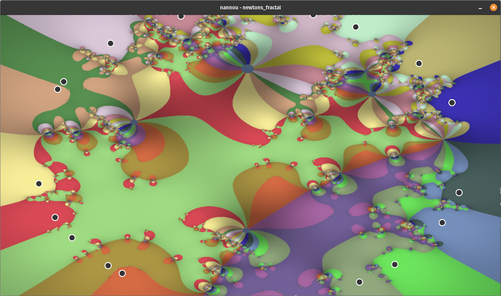
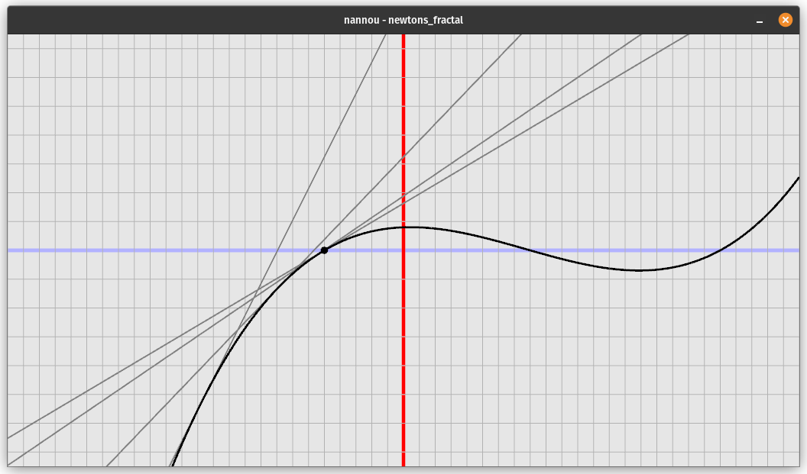

# Newton's fractal program

## annotation:
Visualize how newton's method works for real numbers and it's effects when applied in complex plane by displaying colors depending on which root individual pixel (represented as number in complex plane) converges to.

## theoretical part:

**real plane:**

1. Take last saved x-position (if first take random). Find the first derivative of the function at that point and turn it into linear function. 

$$f(x) = ax+b$$

$$a = f_0'(x_0)$$

$$b = f_0(x_0)-f_0'(x_0)*x_0$$

$$f(x) = f_0'(x_0)*x + f_0(x_0)-f_0'(x_0)*x_0$$

$$f(x) = f_0'(x_0)*(x-x_0) + f_0(x_0)$$

2. Find next x-position where this linear function crosses x-axis (root) and save that point.

$$f_0'(x_0)*x + f_0(x_0)-f_0'(x_0)*x_0 = 0$$

$$x = (f_0'(x_0)*x_0-f_0(x_0))/f_0'(x_0)$$

$$x = x_0-f_0(x_0)/f_0'(x_0)$$

**complex plane**:

Each pixel depending on it's position on screen is represented as a complex number.

Each complex root is represented as a point in 2d space and with random color.

Program for each pixel calculates $n$ iterations of newton's method (same equation as for real plane) and then colors it with the color of closest root to the newly calculated position.

## practical part:

The entire code is written in Rust, a compiled language which provides the required computational speed. 

In order to display values of function or complex numbers to screen, the program uses a camera abstraction.

**real plane:**

Define value $stepscount$ as integer, which determines the smoothness of our function.
Each step draw a line from point $f(i/stepsCount*width)$ to point $f((i+1)/stepsCount*width)$.

When 'space' is pressed perform next iteration by saving x-value where tangent line to our function at previous x-value crosses the x-axes.

**complex plane:**

In order to use complex numbers I use a library called num.

User specifies the number of roots he wants and program places the roots $x_1, x_2, .., x_n$ in a cirle, resulting function becomes:
$$(x-x_1) * (x-x_2) * (x-x_3) .. * (x-x_n)$$
.

Then it calculates function coefficients from roots using permutation method.

From these coefficients we can easily construct derivative of this function.

$$f(x) = a * x ^ A + b * x ^ B$$

$$f'(x) = a * A * x ^ {A - 1} + b * B * x ^ {B-1}$$

User can then press arrows to decrease/increase the number of iterations applied to each pixel or shift roots of the function using mouse.
