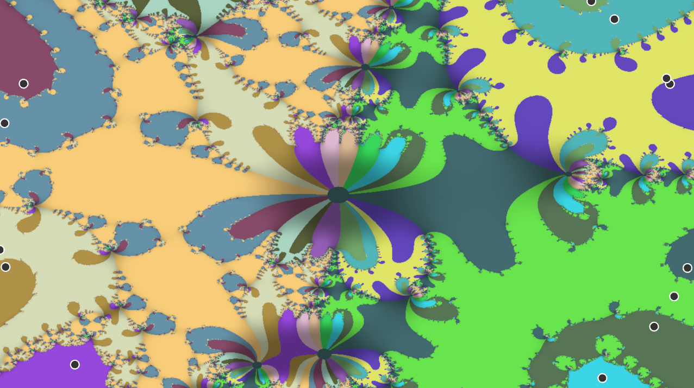

# Program pro vizualizaci Newtonova fraktálu

[GitHub](https://www.github.com/patrik-cihal/newtons.fractal)

## anotace:
Zobrazit funkcionalitu newtonovy metody pro reálná čísla a její efekty pří rozšíření do komplexní roviny, obarvením každého bodu na obrazovce na základě kořenu, který je nejblíže po $n$ iteracích.

## teoretická část:

**reálná rovina:**

Vezme poslední uložený bod (jestliže žádný není vygeneruje náhodný). Najde první derivaci v daném bodě funkce pro kterou hledáme kořen a udělá z toho lineární funkci. 

$$f(x) = ax+b$$

$$a = f_0'(x_0)$$

$$b = f_0(x_0)-f_0'(x_0)*x_0$$

$$f(x) = f_0'(x_0)*x + f_0(x_0)-f_0'(x_0)*x_0$$

$$f(x) = f_0'(x_0)*(x-x_0) + f_0(x_0)$$

Najde další x pozici, kde tato lineární funkce protíná x-ovou osu (kořen) a uloží daný bod.

$$f_0'(x_0)*x + f_0(x_0)-f_0'(x_0)*x_0 = 0$$

$$x = (f_0'(x_0)*x_0-f_0(x_0))/f_0'(x_0)$$

$$x = x_0-f_0(x_0)/f_0'(x_0)$$

**komplexní rovina**:

Každý pixel v závislosti na jeho pozici na obrazovce je reprezentován jako komplexní číslo.

Každý komplexní kořen je reprezentován jako bod ve 2d prostoru spolu s náhodnou barvou.

Program pro každý pixel spočítá $n$ iterací newtonovy metody (stejnou rovnicí jako v reálné rovině) a poté ho obarví barvou nejbližšího kořene k nově spočítané pozici.

## praktická část:

Celý kód je napsaný v Rustu, kompilovaném jazyce, který poskytuje potřebnou výpočetní rychlost. 

Program používá abstrakci kamery pro zobrazení grafu a komplexních čísel na obrazovku.

**reálná rovina:**

Pro definovaný počet kroků $stepsCount$, který určuje hladkost naší funkce,
každý krok nakreslím čáru z bodu
$f(i/stepsCount*width)$
do bodu 
$f((i+1)/stepsCount*width)$

Když zmáčkneme 'mezerník' provede další iteraci uložením dalšího x, kde tečna naší funkce v předchozí x hodnotě protíná x-ovou souřadnici.

**komplexní rovina:**

Pro použítí komplexních čísel používám knihovnu num.

Užívatel nejdříve zadá počet kořenů funkce $n$ a program umístí tyto kořeny $x_1, x_2, .., x_n$ do kružnice. Výsledná funkce vypadá jako:
$$(x-x_1) * (x-x_2) * (x-x_3) .. * (x-x_n)$$

Poté spočítá koeficienty polynomu z kořenů využitím permutační metody.

Z těchto koeficientů můžeme jednoduše zkonstruhovat derivaci funkce.

$$f(x) = a * x ^ A + b * x ^ B$$

$$f'(x) = a * A * x ^ {A - 1} + b * B * x ^ {B - 1}$$

Za pomocí mačkání šipek program snižuje/zvyšuje počet iterací aplikovaných na každý pixel nebo použítím myší posouvá kořeny funkce.
